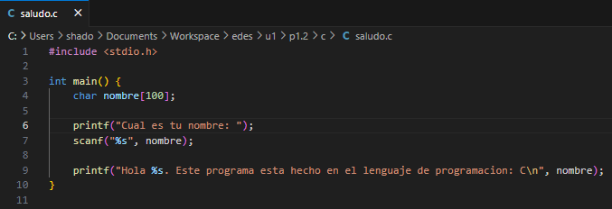
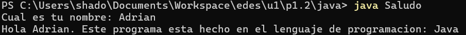

[](https://classroom.github.com/a/9J9TrW2r)
[](https://classroom.github.com/online_ide?assignment_repo_id=16642564&assignment_repo_type=AssignmentRepo)
# Práctica 2: Introducción al desarrollo. Ponlo en práctica. 

Apoyate en los siguientes recursos para realizar la práctica:

[Descripción de la práctica](https://revilofe.github.io/section3/u01/practica/EDES-U1.-Practica011/)


---

# Título de la Actividad

## Identificación de la Actividad
- **ID de la Actividad:** [ID de la actividad]
- **Módulo:** [Nombre del módulo] (`PROG`, `IS`, `EDES`, etc.)
- **Unidad de Trabajo:** [Número y nombre de la unidad de trabajo]
- **Fecha de Creación:** [Fecha de creación]
- **Fecha de Entrega:** [Fecha de entrega]
- **Alumno(s):** 
  - **Nombre y Apellidos:** [Nombre y Apellidos del alumno o integrantes del grupo]
  - **Correo electrónico:** [Correo electrónico g.educaand.es]
  - **Iniciales del Alumno/Grupo:** [Iniciales del alumno o del grupo]

## Descripción de la Actividad
[Descripción detallada de la actividad, objetivos, y contexto necesario para comprenderla. Explicar en qué consiste la actividad y qué se espera que el alumno desarrolle o implemente.]

## Instrucciones de Compilación y Ejecución
1. **Requisitos Previos:**
   - [Lenguaje de programación y versión]
   - [Entorno de desarrollo o dependencias necesarias]

2. **Pasos para Compilar el Código:**
   ```bash
   [Comando para compilar el código]
   ```

3. **Pasos para Ejecutar el Código:**
   ```bash
   [Comando para ejecutar la aplicación]
   ```

4. **Ejecución de Pruebas:**
   ```bash
   [Comandos para ejecutar pruebas, si las hubiera]
   ```

## Desarrollo de la Actividad
### Descripción del Desarrollo
[Explicación de cómo se ha abordado el desarrollo de la actividad, incluyendo las decisiones de diseño, estructura del código y enfoque de resolución de problemas. Se recomienda adjuntar diagramas o capturas de pantalla si es necesario.]

### Código Fuente
[Aquí se incluirá un enlace directo a los archivos de código fuente en el repositorio, por ejemplo, si se está usando GitHub: `src/main.java` o algún enlace directo.]

### Ejemplos de Ejecución
- **Entrada 1:** Descripción de la entrada y valor de prueba.
- **Salida Esperada 1:** Explicación de la salida esperada y el resultado de la prueba.

### Resultados de Pruebas
[Aquí se detallará cómo se ha verificado la funcionalidad del código, incluyendo resultados de pruebas automatizadas o manuales, en caso de que las haya.]

## Documentación Adicional
- **Manual de Usuario:** [Enlace a la documentación del usuario, si existe]
- **Autorización de Permisos:** Verificar que el profesor tenga permisos de lectura en el repositorio para revisar el código.

## Conclusiones
[Resumen de las conclusiones alcanzadas al desarrollar la actividad, las lecciones aprendidas, y posibles mejoras que se puedan implementar en futuras entregas.]

## Referencias y Fuentes
[Aquí se listarán las fuentes consultadas para el desarrollo de la actividad, tales como documentación oficial, artículos, o cualquier recurso externo relevante.]

### Notas Adicionales:
1. **Nombres de Archivos y Repositorios:**
   - Asegúrate de que el nombre del archivo o repositorio siga la estructura definida: `XXX-idActividad-Iniciales`.
2. **Permisos:**
   - Verifica que el profesor tenga los permisos necesarios para acceder al repositorio o documento.
3. **Formato:**
   - Si se entrega en formato PDF o Google Docs, asegúrate de cumplir con el mínimo y máximo de folios establecidos.
4. **Compilación y Ejecución:**
   - Detalla claramente cómo compilar y ejecutar el código, incluyendo las instrucciones en el archivo `README.md`.

# Dinamica

- Trabajar con tres lenguajes de programación diferentes:
   - Lenguajes interpretados (Python).
   - Lenguajes compilados (C).
   - Lenguajes que generan código intermedio ejecutado en una máquina virtual (Java).

# Tarea

- Escribir un pequeño programa en cada lenguaje y responder a las preguntas.

- El programa que se debe desarrollar es el siguiente:

   - Programa:

   - Escribe un programa básico en cada uno de los tres lenguajes elegidos que:
      
      - Pregunte el nombre del usuario.
      - Muestre un mensaje que diga: "Hola [nombre del usuario]. Este programa está hecho en el lenguaje de  programación: [lenguaje]".

## Python

- Para poder escribir el programa necesitaremos instalar previamente Python en nuestro equipo.

- Empezaremos escribiendo el programita yo en mi caso lo hare desde Visual Studio Code


- [Aqui podemos ver el codigo fuente de python](src/saludo.py)

- Despues de escribir el codigo ejecutaremos el codigo usando **Python** en la terminal como podemos ver en la captura.


- En el caso de Python es un lenguaje interpretado por lo que gracias a un interprete se ejecuta linea a linea.

- Los lenguajes interpretados no generan codigo objeto pero python genera un codigo intermedio o bytecode y esto lo ejecuta la maquina virtual de python (PVM) Este proceso suele ser invisible para el usuario.

## C

- Para poder escribir el programa necesitaremos un Compilador en mi caso yo voy a elegir MinGW.

- Empezaremos escribiendo el programita yo en mi caso  lo hare desde Visual Studio Code



- [Aqui podemos ver el codigo fuente en C](src/saludo.c)

- Ahora a partir del codigo fuente lo compilaremos usando gcc -c en la terminal para generar un codigo objeto.


- Ahora generamos el archivo ejecutable.


- Como podemos ver en la siguiente captura se han generado tanto el codigo objeto como el ejecutable.


- Ahora ejecutamos el archivo ejecutable y lo probamos.


- En el caso de C es un lenguaje compilado y como su propio nombre indica necesitamos compilar el codigo fuente para generar un codigo objeto y este convertirlo en un archivo ejecutable.

## Java

- Para poder escribir el programa necesitaremos instalar JDK (Java Development Kit) tiene todo lo que necesitamos.

- Empezaremos por escribir el programa en Visual Studio Code


- [Aqui podemos ver el codigo fuente en Java](src/Saludo.java)

- Ahora usaremos javac en la terminal para compilar el codigo fuente y transformarlo en un archivo .class


- Hacemos un dir para comprobar que se genero el archivo .class


- Ahora ejecutamos el archivo .class con la JVM (Java Virtual Machine)



- En el caso de Java es un lenguaje raro ya que contiene un poco de los dos tipos de lenguajes se compila el codigo fuente en un archivo .class y este lo ejecuta en la maquina virtual de java proporcionandole caracteristicas de los lenguajes interpretados.

# 5.1. Criterio de Evaluación 1.a: Relación entre Software y Hardware¶
Pregunta:

1. Describe cómo el software que has creado se ha relacionado con los componentes físicos del dispositivo (memoria RAM, procesador, periféricos, etc.) durante la ejecución de los tres lenguajes (interpretado, compilado y en máquina virtual).

   - Puntos a incluir:
      - Cómo se almacenaron los datos en memoria.
      - Qué hizo el procesador con el código.
      - Si se interactuó con periféricos, como la pantalla para mostrar la salida.

## Respuesta

### Interpretado (Python)

- **Almacenamineto en Memoria:** Los datos y el bytecode de python se cargan en la RAM. El bytecode es el codigo intermedio generado por el interprete de python.

- **Procesador:** El procesador toma las instrucciones del bytecode desde la memoria RAM y ejecuta las intrucciones decodificadas por la maquina virtual de python linea por linea y todo esto lo hacen en ciclos de ejecucion del procesador.

- **Interaccion con perifericos:** Se interactuan tanto con el teclado cuando pide introducir el nombre y con el monitor cuando se muestra por pantalla funciona de la siguiente manera donde el procesador accede a las instrucciones en la ram si se necesita interactuar con un periferico el procesador envia instrucciones al sistema operativo y despues se almacena en la RAM la informacion recibida. En el caso de de python el interprete realiza la instruccion a traves del sistema operativo.

### Compilado (C)

- **Almacenamineto en Memoria:** El codigo fuente se compila para generar un codigo objeto y este es almacenado en la RAM antes de ser ejecutado como un archivo ejecutable. Tambien almacena datos que se generan durante la ejecucion.

- **Procesador:** El procesador ejecuta directamente el codigo maquina. El compilador transforma el codigo en intrucciones de bajo nivel que el procesador puede ejecutar directamente. Mas concretamente funciona de la siguiente manera el procesador obtiene las isntrucciones de la memoria RAM y despues la CPU decodifica las isntrucciones las cuales ya estan en un formato que el hardware del procesador puede ejecutar.

- **Interaccion con perifericos:**  Funciona de forma similar en todos los lenguajes en resumen el procesador accede a las instrucciones en la RAM y si se necesita interactuar con un periferico el procesador envia instrucciones al sistema operativo y despues se almacena en la RAM la informacion recibida. En el caso de C el codigo compilado interactua directamente con el sistema operativo.

### Lenguaje en Maquina Virtual (Java)

- **Almacenamineto en Memoria:** El codigo fuente se compila a bytecode que se almacena en la RAM el bytecode es un lenguaje intermedio que puede ser interpretado por la maquina virtual de java. Tambien almacena los datos durante la ejecucion.

- **Procesador:** La JVM interpreta o compila en tiempo real el bytecode para convertirlo a intrucciones que el procesador puede entender Si el bytecode generado se compila JIT (Just in time) el procesador lo ejecuta como codigo maquina en tiempo de ejecucion. Mas en concreto funciona de la siguiente manera el codigo fuente se compila a un formato bytecode que el procesador no puede ejecutar este bytecode es interpretado por la maquina virtual de java donde se traduce a instrucciones de lenguaje maquina para que el procesador pueda ejecutar durante la ejecucion la maquina virtual actua como intermediario entre el procesador, la memoria y los perifericos.

- **Interaccion con perifericos:** Funciona de forma similar en todos los lenguajes en resumen el procesador accede a las instrucciones en la RAM y si se necesita interactuar con un periferico el procesador envia instrucciones al sistema operativo y despues se almacena en la RAM la informacion recibida. En el caso de java el bytecode interactua a traves de la maquina virtual de java y esta se comunica con el sistema operativo.

# 5.2. Criterio de Evaluación 1.c: Diferenciación entre Código Fuente, Código Objeto y Ejecutable¶
Preguntas:

1. Explica cómo el código fuente que escribiste se transformó en código objeto y ejecutable en el caso de los lenguajes compilados. ¿Generaste archivos intermedios (código objeto)? ¿Qué nombres tomaron estos archivos?

- Para convertir el codigo fuente en codigo objeto necesitaremos un compilador tras esto se generara un nuevo archivo con la extension .o este archivo tiene intrucciones en lenguaje de bajo nivel aunque aun no es ejecutable para que sea ejecutable se hace a traves de un enlazador el cual toma el codigo objeto y genera el archivo ejecutable en mi caso con extension .exe.

2. Para los lenguajes interpretados, describe cómo el código fuente se ejecutó directamente, sin generar archivos de código objeto o ejecutable.

- En los lenguajes interpretados el codigo fuente se ejecuta directamente sin generar ningun tipo de archivo. Al ejecutar el codigo un interprete lee el codigo linea por linea y ejecutandolo en tiempo real.

3. Para el lenguaje que genera código intermedio (Java, C#), explica cómo el código fuente se transformó en código intermedio (bytecode) y cómo este fue ejecutado por la máquina virtual.

- Para convertir el codigo fuente en codigo intermedio (bytecode) se logra a traves de un compilador en este caso javac este convierte el codigo fuente a un archivo con la extension .class ahora con una maquina virtual de java al ejecutar el bytecode de esta forma el procesador puede ejecutar el codigo permitiendo que el codigo sea portatil y eficiente en multiples plataformas.

# 5.3. Criterio de Evaluación 1.d: Generación de Código Intermedio para Máquinas Virtuales¶
Preguntas:

1. Describe el proceso de generación de código intermedio (bytecode) en el lenguaje que utilizaste que emplea una máquina virtual (por ejemplo, Java o C#).

- En mi caso Java comence compilando el codigo fuente usando el compilador javac que esta dentro del JDK (Java Development Kit) este compilador traduce el codigo fuente a codigo intermedio (bytecode) en un archivo con la extension .class.

2. Explica qué rol juega la máquina virtual en la ejecución del código y cómo difiere de la ejecución directa en un sistema operativo como ocurre con los lenguajes compilados e interpretados.

- La maquina virtual se usa para ejecutar el codigo intermedio se hace mediante una JVm (Java Virtual Machine) y este lo interpreta o lo compila en tiempo de ejecucion usando JIT (Just In Time) esto usa el bytecode para traducirlo a codigo maquina en tiempo real para mejorar el rendimiento y portabilidad.


# 5.4. Criterio de Evaluación 1.e: Clasificación de Lenguajes de Programación¶
Preguntas:

1. Clasifica los tres lenguajes utilizados (interpretado, compilado y en máquina virtual) según su:

   - **Modo de ejecución** (interpretado vs compilado vs máquina virtual).
   - **Nivel de abstracción** (alto nivel vs bajo nivel).
   - **Paradigma de programación** (imperativo, orientado a objetos, funcional).

## Respuesta

| Lenguaje   | Modo de Ejecución  | Nivel de Abstracción | Paradigma de Programación           |
|------------|---------------------|----------------------|------------------------------------|
| Python     | Interpretado        | Alto nivel           | Imperativo, Orientado a Objetos, Funcional |
| C          | Compilado           | Bajo nivel           | Imperativo                         |
| Java       | Maquina Virtual     | Alto nivel           | Imperativo, Orientado a Objetos    |


2. Explica qué características de estos lenguajes influyeron en su clasificación.

## Python

- Es un lenguaje interpretado se ejecuta su codigo linea a linea mediante el uso de un interprete, tiene un alto nivel de abstraccion lo que hace que sea facil de usar y soporta multiples paradigmas de programacion como la orientada a objeto , funcional y imperativa.

## C

- Es un lenguaje compilado  el codigo fuente se convierte a codigo objeto y este en codigo maquina antes de que pueda ser ejecutado, tiene un nivel de abstraccion de bajo nivel porque proporciona control sobre los recursos del hardware, su paradigma es imperativo.

## Java

- Es un lenguaje que genera un bytecode y se ejecuta en una maquina virtual, tiene un nivel de abstraccion alto debido a que tiene un gran portabilidad entre plataformas, sus paradigmas son orientada a objetos y imperativo.

# 5.5. Criterio de Evaluación 1.f: Evaluación de Herramientas Utilizadas en el Desarrollo¶
Preguntas:

1. Para cada uno de los tres lenguajes (interpretado, compilado y en máquina virtual), describe las herramientas que utilizaste en el proceso de desarrollo:
   - **Sistema operativo** (¿en qué sistema ejecutaste el programa?).
   - **Editor de texto o IDE** (¿dónde escribiste el código?).
   - **Compilador o intérprete** (¿cómo se transformó o ejecutó el código?).
   - **Depurador** (si lo usaste, ¿cómo lo empleaste para encontrar errores?).
   - **Sistema de gestión de versiones** (si lo usaste, ¿cómo guardaste las versiones del código?).

## Respuesta

### Python (Interpretado)

- **Sistema operativo:** Windows

- **Editor de texto o IDE:** Visual Studio Code es un IDE con gran soporte de plugins con herramientas de depuracion y terminal integrada permite editar, depurar y ejecutar todo en un mismo lugar

- **Compilador o intérprete:** Interprete usando el comando Python en la terminal

- **Depurador:** No use ningun tipo de depurardor ya que es un codigo pequeño en el caso que se necesite se usara el que viene integrado en Visual Studio Code

- **Sistema de gestión de versiones:**  Git puede ser usado para gestionar el codigo y realizar seguimiento de los cambios.

### C (Compilado)

- **Sistema operativo:** Windows

- **Editor de texto o IDE:** Visual Studio Code es un IDE con gran soporte de plugins con herramientas de depuracion y terminal integrada permite editar, depurar y ejecutar todo en un mismo lugar

- **Compilador o intérprete:** Compilado usando MingGW que tiene GCC para compilar el codigo fuente en codigo objeto y este a traves de un enlazador para generar un ejecutable

- **Depurador:** No use ningun tipo de depurardor ya que es un codigo pequeño en el caso que se necesite se usara el que viene integrado en Visual Studio Code

- **Sistema de gestión de versiones:**  Git puede ser usado para gestionar el codigo y realizar seguimiento de los cambios.

### Java (Maquina Virtual)

- **Sistema operativo:** Windows

- **Editor de texto o IDE:** Visual Studio Code es un IDE con gran soporte de plugins con herramientas de depuracion y terminal integrada permite editar, depurar y ejecutar todo en un mismo lugar

- **Compilador o intérprete:** Compilador javac para generar el bytecode a partir del codigo fuente y despues es interpretado por la JVM.

- **Depurador:** No use ningun tipo de depurardor ya que es un codigo pequeño en el caso que se necesite se usara el que viene integrado en Visual Studio Code

- **Sistema de gestión de versiones:**  Git puede ser usado para gestionar el codigo y realizar seguimiento de los cambios.


# Conclusion final

- Tas la realizacion del trabajo me sirvio para aprender como funcionan los diferentes tipos de lenguajes (interpretrado, compilado y maquina virtual). En este caso nos hemos centrado en Python, C y Java para aprender como funcionan tanto a nivel de ejecucion, abstraccion y paradigmas, tambien pude ver mas en profuncidad como estos lenguajes interactuan con el hardware y los perifericos y las herramientas necesarias para hacer funcionar cada lenguaje.